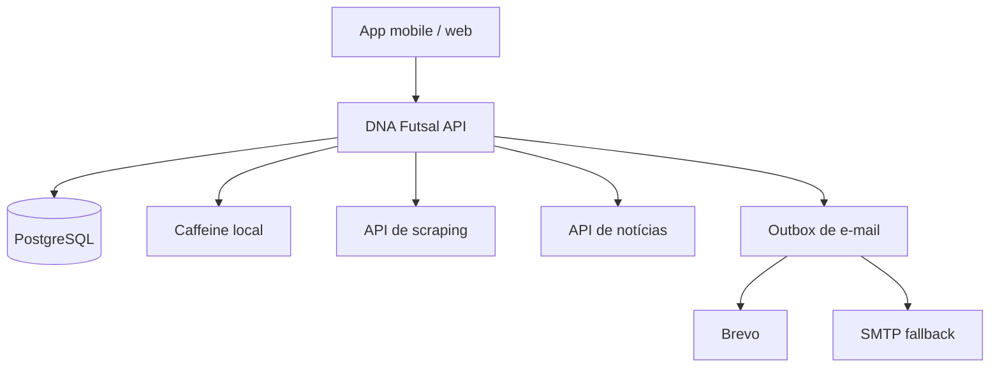

# DNA Futsal Backend

Backend do aplicativo DNA Futsal, implementado como monólito modular com Java 17 e Spring Boot 4.1.0. O projeto cobre cadastro e confirmação de e-mail, login por e-mail ou telefone, sessões JWT, perfil protegido por senha, redefinição de senha, dados esportivos vindos do scraper, notícias de uma aplicação externa, cache local Caffeine e entrega de e-mail tolerante a falhas.

## Decisões de arquitetura

O MVP é mantido em um único deploy, mas o código está separado em quatro módulos de negócio:

- `identity`: cadastro, confirmação, login, sessões, perfil e senha;
- `sports`: catálogo, jogos, classificação, artilharia e atualização do cache;
- `news`: fachada HTTP para a aplicação que publica as notícias;
- `mail`: outbox transacional, Brevo e fallback SMTP.

Essa divisão evita a complexidade operacional de microsserviços para uma equipe de uma pessoa e mantém portas claras para extrair um módulo no futuro. O backend **não acessa diretamente o banco da aplicação de notícias**: o contrato HTTP impede acoplamento de schema, credenciais compartilhadas e deploys coordenados.



## Requisitos implementados

- Cadastro obrigatório com nome, e-mail, telefone e senha; Instagram do filho, evento, categoria, divisão e time são opcionais.
- Confirmação obrigatória por e-mail antes do primeiro login.
- Login com e-mail **ou** telefone e senha.
- Access token JWT de 15 minutos e refresh token rotativo de 30 dias.
- Perfil em cache e edição integral mediante confirmação da senha atual.
- Troca de e-mail exige nova confirmação e revoga as sessões existentes.
- Redefinição de senha por link de uso único, com no máximo três solicitações por usuário/dia no fuso `America/Sao_Paulo`.
- Respostas genéricas no pedido de redefinição para não revelar quais usuários existem.
- Cache Caffeine local para perfil, versão de segurança, eventos, equipes e snapshots esportivos.
- Endpoints separados para partidas encerradas e futuras.
- Preferências do perfil usadas quando o front não envia filtros esportivos.
- Proxy autenticado da aba de notícias para outra aplicação/banco.
- Brevo como provedor primário, SMTP como fallback e outbox com até dez tentativas e backoff.
- Flyway, health checks, métricas Prometheus, CORS restritivo e erros em `application/problem+json` correlacionados por `requestId`.

### O que não vai para o cache

Senha, hash de senha, token de confirmação e token de redefinição não são cacheados. “Cachear credenciais” aumentaria o impacto de um vazamento e não melhora o desenho de autenticação. O Caffeine guarda em memória somente o perfil não secreto, a versão/status usada para revogar JWTs e contadores de proteção contra força bruta. Tokens de uso único são persistidos no PostgreSQL somente como SHA-256; refresh tokens também são persistidos somente como hash.

## Endpoints

| Método | Caminho | Acesso | Finalidade |
| --- | --- | --- | --- |
| `POST` | `/api/v1/auth/register` | Público | Cadastrar conta pendente |
| `GET` | `/api/v1/auth/email-verification/confirm?token=` | Público | Confirmar e-mail |
| `POST` | `/api/v1/auth/email-verification/resend` | Público | Reenviar confirmação pendente |
| `POST` | `/api/v1/auth/login` | Público | Login por e-mail ou telefone |
| `POST` | `/api/v1/auth/refresh` | Público | Rotacionar refresh token |
| `POST` | `/api/v1/auth/logout` | Público | Revogar refresh token |
| `POST` | `/api/v1/auth/password-reset/request` | Público | Solicitar alteração de senha |
| `POST` | `/api/v1/auth/password-reset/confirm` | Público | Confirmar nova senha |
| `GET`, `PUT` | `/api/v1/me` | Bearer | Consultar/alterar perfil |
| `GET` | `/api/v1/public/events?season=` | Público | Pesquisar competições |
| `GET` | `/api/v1/public/events/{eventId}` | Público | Consultar competição |
| `GET` | `/api/v1/public/events/{eventId}/teams` | Público | Times da competição |
| `GET` | `/api/v1/matches/played` | Bearer | Jogos já encerrados |
| `GET` | `/api/v1/matches/upcoming` | Bearer | Jogos futuros |
| `GET` | `/api/v1/standings` | Bearer | Classificação |
| `GET` | `/api/v1/top-scorers` | Bearer | Artilharia |
| `GET` | `/api/v1/news` | Bearer | Notícias publicadas |
| `GET` | `/api/v1/news/{slug}` | Bearer | Notícia completa |

O contrato detalhado está em [`docs/openapi.yaml`](docs/openapi.yaml). Os formatos esperados das APIs de scraping e notícias estão em [`docs/integrations.md`](docs/integrations.md).

## Executar localmente

Pré-requisitos: JDK 17+, Docker e Docker Compose.

```bash
cp .env.example .env
docker compose up -d postgres mailpit
./mvnw spring-boot:run
```

- API: `http://localhost:8080`
- Health: `http://localhost:8080/actuator/health`
- Mailpit: `http://localhost:8025`

Para executar tudo em containers:

```bash
docker compose --profile app up --build
```

As APIs esportiva e de notícias são consumidas sem chaves. O perfil `prod` impede a inicialização somente quando `JWT_SECRET` permanece vazio ou inseguro.

## Testes e build

```bash
./mvnw test
./mvnw clean package
```

Os testes unitários cobrem normalização de telefone, tokens opacos, fallback de e-mail, contrato HTTP do scraper, normalização de snapshots, filtros esportivos, correlação de erros, configuração do cache e rate limit de login. O teste de integração usa Testcontainers/PostgreSQL e valida Flyway versus entidades; ele é ignorado automaticamente quando Docker não está disponível.

## Política do cache esportivo

1. Pesquisas de eventos e listas de equipes permanecem no Caffeine local por uma hora.
2. O snapshot normalizado de cada `eventId` permanece no Caffeine local por dez minutos.
3. Quando o TTL expira, a próxima consulta recarrega o snapshot completo do scraper.
Os TTLs e limites podem ser ajustados por ambiente. O cache é isolado por processo e apagado em cada reinicialização; por isso, uma futura execução com múltiplas instâncias exigirá um armazenamento compartilhado para rate limit e invalidação coordenada. Falhas externas são diferenciadas entre resposta inválida (`502`), indisponibilidade (`503`) e timeout (`504`).

Os limites padrão são 2.000 entradas por cache esportivo, 10.000 por cache de identidade e 50.000 contadores de login. Eles podem ser alterados por `SPORTS_CACHE_MAX_ENTRIES`, `IDENTITY_CACHE_MAX_ENTRIES` e `LOGIN_ATTEMPT_CACHE_MAX_ENTRIES`.

## E-mail e recuperação de desastre

Cada e-mail nasce na mesma transação do cadastro ou da redefinição de senha. O dispatcher tenta Brevo e, se ele falhar, tenta SMTP imediatamente. Quando os dois falham, a outbox agenda novas tentativas com backoff exponencial; após o limite, a mensagem fica `DEAD` para alerta e intervenção.

Em produção, Brevo e SMTP devem ser infraestruturas independentes. Configurar como fallback outro caminho que usa o mesmo domínio, conta ou relay elimina boa parte da tolerância a falhas.

## Segurança e LGPD

- Use TLS em todas as conexões externas e mantenha o PostgreSQL privado.
- Rotacione `JWT_SECRET` e credenciais de provedores por secret manager.
- O Instagram do filho é dado pessoal de menor. Ele não aparece em endpoints esportivos nem em logs, mas a base legal, consentimento verificável do responsável, retenção e exclusão precisam ser definidos com jurídico antes do lançamento.
- O conteúdo de e-mails pendentes contém links temporários e fica no banco somente até envio ou esgotamento das tentativas; restrinja acesso à tabela `mail_outbox`.
- Configure alertas para mensagens `DEAD`, falhas da API esportiva, falhas da API de notícias e crescimento de respostas `401/429`.

## Próximas fronteiras do produto

O contexto mais amplo do DNA Futsal ainda prevê notificações configuráveis, marketplace, vídeos e painel administrativo. Eles não foram misturados nesta entrega porque exigem decisões próprias de domínio (provedor push, catálogo/pagamento, moderação e papéis administrativos). A estrutura modular atual permite adicioná-los sem reescrever autenticação e esportes.
